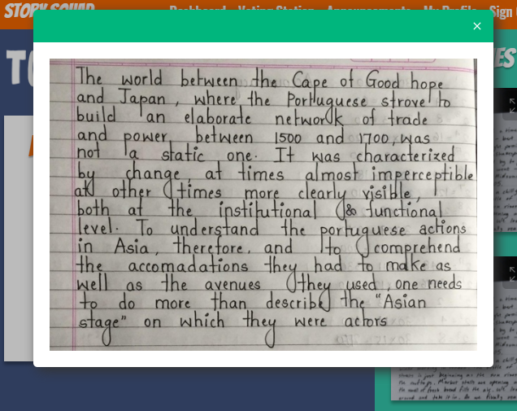

# Modal

The `Modal` is a higher-order component that displays another component in a floating container on the screen. It renders a transparent black mask over the application with a floating container positioned horizontally in its center.



The modal can be closed by clicking on the `X` in the top-right corner (not shown in picture), or by clicking anywhere outside of the modal (unless otherwise specified, see [below](#-closable)).

When opened and closed, the modal will slowly fade in and out using CSS transitions and careful z-indexing. Recklessly z-indexing your page elements may affect these animations.

## Modal Export

The component is exported alongside a helper interface to extend when wrapping a component. To use the component, use the JSX tag `<Modal.Component>`. To use the props interface, use `Modal.ModalComponentProps`.

## Higher-Order Component (HoC)

The `Modal` is a `HoC`, which is any component that takes another component as a property, like the `component` prop on a `<Route />`.

The Modal is used in more or less the same way:

```jsx
<Modal.Component component={ComponentName} />
```

All components passed into a modal by callback receive the closeModal function:

```tsx
<Modal.Component component={RenderedComponent} />
```

To render a component instead by callback (especially when you want to pass other props into that inner component), read the props passed into the callback function:

```tsx
<Modal.Component
  component={(props) => <RenderedComponent {...props} otherProp={value} />}
/>
```

When you need the given closeModal function, just extend the props for your component to satisfy TypeScript:

```ts
interface RenderedComponentProps extends Modal.ModalComponentProps {
  otherProp: any;
}
```

## Properties

The modal has other properties to help make it more interactive:

- `component` - a valid React component to render
- `title` - a string to render in the modal header
- `visible` - boolean
- `setVisible` - setState function
- `closable` - boolean _(optional, default `true`)_
- `centered` - boolean _(optional, default `false`)_
- `className` - string _(optional)_

### Example Use In Component

```jsx
const Component = () => {
  const [visible, setVisible] = useState(false);
  return (
    <div>
      <Modal
        title="Some Title!"
        component={SomeComponent}
        visible={visible}
        setVisible={setVisible}
      >
      {/* This button will display the modal */}
      <button onClick={() => setVisible(true)}>Show Modal</button>
    </div>
  )
}
```

### `title`

An optional title to be passed in that is displayed in the Modal header. If nothing is passed in, the title will default to an empty string and the modal will render with an empty header.

### `visible`

`visible` should be a controlled state element for the modal to function properly. If `true`, the modal will be displayed on the page. If `false`, the modal will be hidden.

### `setVisible`

`setVisible` should be the relevant setState callback to control the `visible` property. The Modal uses this function to close itself and will not function properly if not used correctly.

### `closable`

If `closable` is `true`, an `X` will be displayed in the top-right corner, and the modal can be closed by clicking either the `X` or the area outside of the modal.

if `closable` is `false`, the modal can only be closed by calling `setVisible(false)` somewhere in the rendered component, such as on an OK button.

### `centered`

If `true`, the modal will be centered on the screen using flexbox. If false, it will still be horizontally centered, but will be rendered near the top of the screen with some padding.

### `className`

All this does is adds custom JSX `classNames` to a modal for more specific styling needs.
